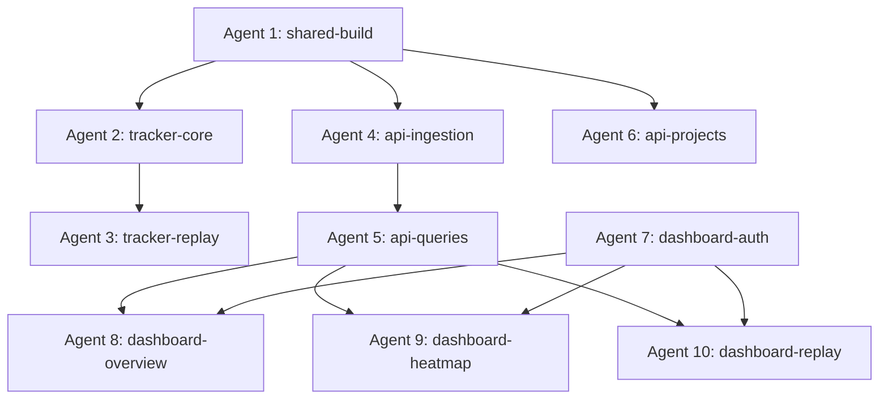

# Agent Implementation Specs

10 agents across 3 phases + Phase 4 (lead agent integration). Each spec defines inputs, outputs, files to create/modify, and acceptance criteria.

Machine-readable agent definitions are in `agents.json` at the project root.

**Effort estimate:** ~17.5h wall-clock / ~33.5 agent-hours across Phases 1–3. Phase 4: ~2h (lead agent).

## Dependency Graph

---

## Phase 1: Foundation

### Agent 1: shared-build

**Goal:** Finalize the shared package — ensure all types, schemas, and DDL compile and are tested.

**Files:**
- `packages/shared/src/**` (review & fix any issues)
- `packages/shared/src/__tests__/schemas.test.ts` (new)
- `packages/shared/src/__tests__/ddl.test.ts` (new)

**Acceptance criteria:**
- `pnpm --filter @analytics-platform/shared build` passes
- `pnpm --filter @analytics-platform/shared test` passes (schema validation, DDL string assertions)
- All types are re-exported from index.ts

---

### Agent 2: tracker-core

**Goal:** Implement the core tracker: pageviews, clicks, scroll depth, event batching, and beacon flush.

**Depends on:** Agent 1

**Files:**
- `packages/tracker/src/index.ts` — full `init()` implementation
- `packages/tracker/src/session.ts` — session ID generation + persistence (sessionStorage)
- `packages/tracker/src/batch.ts` — event queue, flush via `navigator.sendBeacon` with `fetch` fallback
- `packages/tracker/src/listeners.ts` — pageview (History API), click, scroll depth
- `packages/tracker/src/device.ts` — screen size, device type detection
- `packages/tracker/src/__tests__/batch.test.ts`
- `packages/tracker/src/__tests__/session.test.ts`

**Contracts:**
- `init(config: TrackerConfig)` creates singleton, attaches listeners, starts flush interval
- `tracker.ts`: Main `AnalyticsTracker` class. Auto-tracks pageviews on `popstate`/`pushState` (monkey-patch `history.pushState` and `history.replaceState`). Registers click listener. Generates sessionId via `crypto.randomUUID()`. Determines deviceType from viewport width using `DEVICE_BREAKPOINTS`.
- `session.ts`: Creates sessionId, stores in `sessionStorage` under key `ap_session_id`. Detects new sessions (30min inactivity timeout via `SESSION_TIMEOUT_MS`). Fires `session_start`/`session_end` events.
- `batch.ts`: Queue with flush interval (default 5s from `FLUSH_INTERVAL_MS`) and max batch size (`MAX_BATCH_SIZE`). Uses `navigator.sendBeacon` for flush-on-unload, falls back to `fetch` with `keepalive: true`. Retry with exponential backoff (1s, 2s, 4s, max 3 retries).
- `listeners.ts`: Pageview listener (History API patches + popstate), click listener (capture x, y, CSS selector chain), scroll depth tracker.
- `device.ts`: `getDeviceType(width)` using `DEVICE_BREAKPOINTS`, screen dimensions.
- Batch format: `POST /api/collect` with JSON body matching `eventBatchSchema`

**Acceptance criteria:**
- `pnpm --filter @marlinjai/analytics-tracker build` produces dist/ <6KB gzip (excluding rrweb)
- Unit tests pass for batching logic and session management
- No runtime dependencies (only `@analytics-platform/shared` types used at build time)

---

### Agent 3: tracker-replay

**Goal:** Add optional session replay recording via rrweb.

**Depends on:** Agent 2

**Files:**
- `packages/tracker/src/replay.ts` — lazy rrweb import, chunked recording, flush as `replay_chunk` events
- `packages/tracker/src/__tests__/replay.test.ts`
- Update `packages/tracker/src/index.ts` — call replay init if `config.replay === true`

**Contracts:**
- rrweb imported via dynamic `import('rrweb')` — no bundled rrweb code
- Recording chunks flushed every 10 seconds as `replay_chunk` events
- Each chunk is an array of rrweb event objects
- Max chunk size: `MAX_REPLAY_CHUNK_BYTES` (512KB)

**Acceptance criteria:**
- Build still <6KB gzip (rrweb not bundled)
- Replay module gracefully no-ops if rrweb is not installed
- Chunk splitting works correctly for large recordings

---

### Agent 4: api-ingestion

**Goal:** Implement `POST /api/collect` — the ingestion endpoint.

**Depends on:** Agent 1

**Files:**
- `packages/dashboard/src/app/api/collect/route.ts` — Next.js route handler
- `packages/dashboard/src/lib/clickhouse.ts` — ClickHouse client (HTTP interface)
- `packages/dashboard/src/lib/enrich.ts` — IP hashing, country lookup stub
- `packages/dashboard/src/lib/api-key.ts` — API key validation against Postgres

**Contracts:**
- `POST /api/collect` accepts JSON body validated by `eventBatchSchema`
- Header: `X-API-Key: ap_live_...` or `ap_test_...`
- Server enriches each event: `ipHash` (SHA-256 of IP + daily salt), `country` (stub for now), `receivedAt`
- Batch insert into ClickHouse `analytics.events`
- Response: `{ ok: true }` (200) or `{ error: string }` (4xx/5xx)
- Rate limit: 100 requests/min per API key (in-memory, upgrade to Redis later)

**Acceptance criteria:**
- Valid batches are inserted into ClickHouse
- Invalid payloads return 400 with Zod error details
- Invalid/revoked API keys return 401
- Test events (`ap_test_` keys) are stored but flagged

---

## Phase 2: Backend

### Agent 5: api-queries

**Goal:** Implement query API routes for stats, heatmaps, sessions, and replay.

**Depends on:** Agent 4

**Files:**
- `packages/dashboard/src/app/api/stats/route.ts` — overview + timeseries
- `packages/dashboard/src/app/api/stats/pages/route.ts` — top pages
- `packages/dashboard/src/app/api/heatmap/route.ts` — heatmap data
- `packages/dashboard/src/app/api/sessions/route.ts` — session list
- `packages/dashboard/src/app/api/sessions/[sessionId]/replay/route.ts` — replay chunks
- `packages/dashboard/src/lib/queries/stats.ts` — ClickHouse query builders
- `packages/dashboard/src/lib/queries/heatmap.ts`
- `packages/dashboard/src/lib/queries/sessions.ts`

**Contracts:**
- All query routes require authenticated session (NextAuth) + project membership
- Request params validated by corresponding Zod schemas from shared
- Stats: returns `StatsOverview` + `TimeseriesPoint[]`
- Heatmap: returns `HeatmapPoint[]` with 10px bucketed coordinates
- Sessions: returns paginated `SessionSummary[]` with cursor
- Replay: returns ordered array of rrweb event chunks

**Acceptance criteria:**
- Each route returns correct response types
- ClickHouse queries use materialized views where applicable
- Date range filtering works correctly
- Cursor-based pagination for sessions

---

### Agent 6: api-projects

**Goal:** CRUD for projects and API keys.

**Depends on:** Agent 1

**Files:**
- `packages/dashboard/src/app/api/projects/route.ts` — list + create
- `packages/dashboard/src/app/api/projects/[projectId]/route.ts` — get + update + delete
- `packages/dashboard/src/app/api/projects/[projectId]/keys/route.ts` — list + create API keys
- `packages/dashboard/src/app/api/projects/[projectId]/keys/[keyId]/route.ts` — revoke
- `packages/dashboard/src/lib/db.ts` — Postgres client (pg or postgres.js)
- `packages/dashboard/src/lib/crypto.ts` — API key generation + hashing

**Contracts:**
- API key format: `ap_live_` or `ap_test_` + 32 random hex chars
- Only the hash is stored in Postgres; full key shown once on creation
- Project CRUD requires owner/admin membership
- Key revocation sets `revoked_at` timestamp (soft delete)

**Acceptance criteria:**
- Projects can be created, listed, updated, deleted
- API keys can be created and revoked
- Full key is returned only on creation response
- Role-based access enforced

---

### Agent 7: dashboard-auth

**Goal:** NextAuth v5 authentication with credentials + GitHub OAuth.

**Depends on:** Postgres running

**Files:**
- `packages/dashboard/src/lib/auth.ts` — NextAuth config
- `packages/dashboard/src/app/api/auth/[...nextauth]/route.ts`
- `packages/dashboard/src/app/login/page.tsx` — login page
- `packages/dashboard/src/middleware.ts` — protect dashboard routes

**Contracts:**
- NextAuth v5 with Postgres adapter
- Providers: GitHub OAuth + Credentials (email/password for dev)
- Session strategy: JWT
- Middleware protects all routes except `/login`, `/api/collect`, and static assets
- Session includes `userId` for membership lookups

**Acceptance criteria:**
- GitHub OAuth login flow works
- Credentials login works (dev only)
- Unauthenticated users redirected to `/login`
- `/api/collect` is NOT protected by auth middleware (uses API keys)

---

## Phase 3: Dashboard UI

### Agent 8: dashboard-overview

**Goal:** Analytics overview page with charts.

**Depends on:** Agent 5, Agent 7

**Files:**
- `packages/dashboard/src/app/(dashboard)/layout.tsx` — sidebar + project switcher
- `packages/dashboard/src/app/(dashboard)/page.tsx` — overview page
- `packages/dashboard/src/components/charts/TimeseriesChart.tsx`
- `packages/dashboard/src/components/charts/StatsCards.tsx`
- `packages/dashboard/src/components/charts/TopPagesTable.tsx`
- `packages/dashboard/src/components/layout/Sidebar.tsx`
- `packages/dashboard/src/components/layout/ProjectSwitcher.tsx`

**Contracts:**
- Fetches from `/api/stats` and `/api/stats/pages`
- Date range picker (7d, 30d, 90d, custom)
- Timeseries chart: pageviews + visitors line chart
- Stats cards: pageviews, visitors, sessions, avg duration, bounce rate
- Top pages table: URL, views, visitors, sortable

**Acceptance criteria:**
- Overview page renders with real data from API
- Date range changes refetch data
- Responsive layout (mobile sidebar collapses)
- Loading states and empty states

---

### Agent 9: dashboard-heatmap

**Goal:** Heatmap visualization page.

**Depends on:** Agent 5, Agent 7

**Files:**
- `packages/dashboard/src/app/(dashboard)/heatmap/page.tsx`
- `packages/dashboard/src/components/heatmap/HeatmapOverlay.tsx` — canvas-based heatmap
- `packages/dashboard/src/components/heatmap/UrlSelector.tsx`
- `packages/dashboard/src/components/heatmap/DeviceToggle.tsx`

**Contracts:**
- User selects a URL from tracked pages, device type filter
- Fetches from `/api/heatmap`
- Renders iframe of the target URL with canvas overlay
- Heatmap uses gradient coloring (cold blue → hot red)
- Canvas scales with iframe dimensions

**Acceptance criteria:**
- Heatmap renders correctly over iframe content
- Device type filter changes the data
- Color gradient accurately represents click density
- Works for different viewport sizes

---

### Agent 10: dashboard-replay

**Goal:** Session replay player page.

**Depends on:** Agent 5, Agent 7

**Files:**
- `packages/dashboard/src/app/(dashboard)/replay/page.tsx` — session list
- `packages/dashboard/src/app/(dashboard)/replay/[sessionId]/page.tsx` — player
- `packages/dashboard/src/components/replay/SessionList.tsx`
- `packages/dashboard/src/components/replay/ReplayPlayer.tsx` — rrweb-player wrapper
- `packages/dashboard/src/components/replay/ReplayTimeline.tsx`

**Contracts:**
- Session list page: paginated table from `/api/sessions`
- Player page: fetches chunks from `/api/sessions/{id}/replay`
- Uses `rrweb-player` for playback (npm package)
- Timeline shows events overlay (clicks, page navigations)
- Playback controls: play/pause, speed (1x, 2x, 4x), skip inactivity

**Acceptance criteria:**
- Session list shows duration, pageviews, country, device
- Replay player plays back recorded sessions smoothly
- Speed controls work
- Skip inactivity jumps to next user action

---

## Phase 4: Integration & Production Hardening

**Goal:** Wire everything together end-to-end, create production Docker setup, finalize docs.

**Lead agent task (not parallelized).**

**Tasks:**
1. Wire SDK modules end-to-end: tracker -> ingestion -> queries -> dashboard
2. End-to-end integration test: init tracker on test page, generate events, verify they appear in dashboard
3. Create `packages/dashboard/Dockerfile` — multi-stage build (Node 20 Alpine, standalone output)
4. Tune `docker-compose.yml` — verify healthchecks, volumes, restart policies work in production
5. Write self-hosting guide in `docs/public/self-hosting.md`
6. Create install script (`scripts/setup.sh`) — one-command database initialization (run Postgres + ClickHouse DDL)
7. Production hardening: CORS configuration, CSP headers, rate limiting review
8. Finalize README with complete setup instructions

**Acceptance criteria:**
- `docker compose up` starts all 3 services and the dashboard is accessible at localhost:3000
- Tracker SDK can be installed, initialized, and events appear in the dashboard
- ClickHouse and Postgres schemas are auto-initialized on first run
- Self-hosting guide covers: prerequisites, setup, configuration, upgrading
