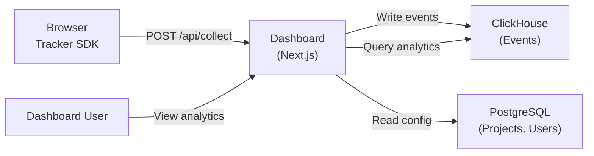

# Architecture

## System Overview

## Data Flow

### Ingestion Path

1. **Tracker SDK** batches events in the browser (configurable flush interval)
2. **POST /api/collect** receives batch, validates via Zod schemas
3. Server enriches events: IP hash (SHA-256, no raw IP stored), country (GeoIP lookup)
4. Events inserted into ClickHouse `analytics.events` table
5. ClickHouse materialized views auto-aggregate for pageviews, heatmaps, sessions

### Query Path

1. Dashboard API routes query ClickHouse materialized views
2. For heatmaps: aggregated click coordinates bucketed to 10px grid
3. For replay: raw rrweb chunks fetched by session ID, ordered by timestamp
4. For stats: pre-aggregated hourly pageview/visitor counts

## Storage Design

### ClickHouse (Events)

One wide `events` table with sparse columns — all event types share the same table. This avoids JOINs and simplifies ingestion.

**Materialized views:**
- `pageviews_hourly_mv` — pageview + unique visitor counts per URL per hour
- `heatmap_clicks_mv` — click coordinates bucketed to 10px grid per URL per day
- `sessions_summary_mv` — session duration, pageview count, country, device

**Partitioning:** by month (`toYYYYMM(timestamp)`)
**TTL:** 12 months automatic expiry
**Order key:** `(project_id, type, timestamp)` — optimized for per-project, per-type queries

### PostgreSQL (Config)

- `projects` — project name + domain
- `api_keys` — hashed keys with `ap_live_`/`ap_test_` prefixes
- `users` — NextAuth-managed user accounts
- `memberships` — user-to-project role assignments

## Key Design Decisions

1. **Combined dashboard + API** — Next.js API routes serve both the UI and the tracker ingestion endpoint. Single container deployment.
2. **No brain-core dependency** — standalone project with own auth (NextAuth), own Postgres, own API key format.
3. **Wide ClickHouse table** — sparse columns + MVs beat normalized tables for analytics workloads.
4. **Zero runtime deps in tracker** — target <6KB gzip. rrweb is an optional peer dependency loaded lazily.
5. **IP hashing, not storage** — SHA-256 hash for unique visitor counting. Raw IPs never stored.

## Technology Choices

| Component | Choice | Rationale |
|-----------|--------|-----------|
| Tracker | Vanilla TS | Zero deps, <6KB, works everywhere |
| Replay | rrweb | Battle-tested DOM recording, MIT license |
| Analytics DB | ClickHouse | Purpose-built for analytics, column-oriented, fast aggregations |
| Config DB | PostgreSQL | Relational data (users, projects), NextAuth adapter support |
| Dashboard | Next.js 15 | API routes + SSR + React 19, single deployment unit |
| Auth | NextAuth v5 | Built-in Postgres adapter, OAuth providers |
| Styling | Tailwind CSS v4 | Utility-first, consistent with other ERP Suite projects |
